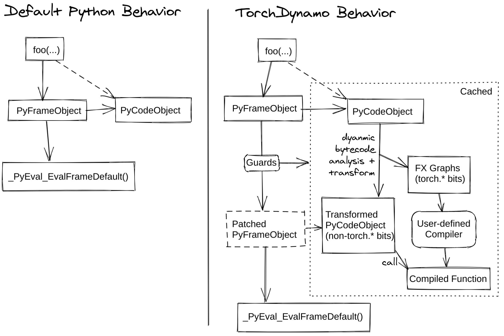

# Some basic intro of torchdynamo

@gglin001
Jun 8 2023

---

# TOC

- torchdynamo & torch 2.0
- PEP 523
- Bytecode transform in torchdynamo
- Guard
- Backend
- torchdynamo code structure
- Paddle + (torch)dynamo = a better Paddle

---

# torchdynamo & torch 2.0

all starts from:

<!-- https://pytorch.org/docs/stable/dynamo/index.html -->

---

# PEP 523

> This PEP proposes to expand CPython’s C API to allow for the specification of a per-interpreter function pointer to handle the evaluation of frames

https://peps.python.org/pep-0523/

---

# Bytecode transform in torchdynamo

a simple example

- target_0_add.py

---

# Bytecode transform in torchdynamo

more complex examples

- target_1_add_func.py
- target_2_print.py
- target_3_if.py
- target_4_module.py

- ...(Python & torch is very flexible)

---

# Guard

Speed up bytecode interpretation through caching
(wont be covered in this talk)

- https://github.com/pytorch/pytorch/blob/main/docs/source/compile/guards-overview.rst

- https://github.com/pytorch/pytorch/blob/main/docs/source/compile/deep-dive.rst

---

# Backend

- https://github.com/pytorch/pytorch/blob/main/docs/source/compile/custom-backends.rst

- torch/\_dynamo/backends
  check `torch/_dynamo/backends/onnxrt.py` for a quick review

---

# torchdynamo code structure

- (doc) docs/source/compile

- torch/\_dynamo/
- torch/csrc/dynamo

---

# Paddle + (torch)dynamo = a better Paddle(in my view)

- modernization(AI framework with compiler acceleration)
- performance(vs eager mode, see torch 2.0 reports)
- opportunity(more friendly for custom backends integration)
- ... (https://pytorch.org/get-started/pytorch-2.0/ as reference)

## (re)invent a wheel for paddle at

https://github.com/PFCCLab/paddlefx
